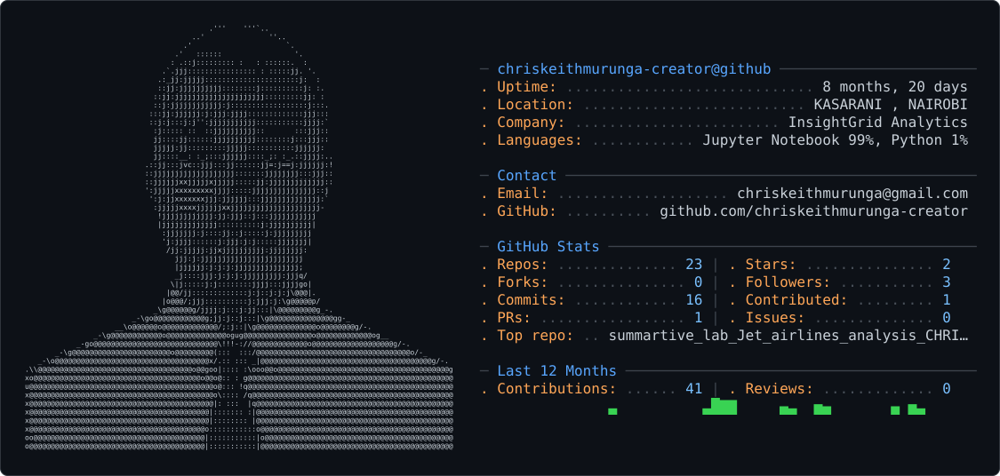

<picture>
  <source media="(prefers-color-scheme: dark)" srcset="dark_mode.svg" />
  <source media="(prefers-color-scheme: light)" srcset="light_mode.svg" />
  
</picture>

# Hi, I'm Keith Chris Murunga 👋

**Data Analyst & Data Scientist** | Aspiring Software Engineer | Founder, **InsightGrid Analytics** | Nairobi, Kenya 🇰🇪

I build data-driven solutions — from predictive models to full analytics pipelines — with a focus on practical, real-world impact across East Africa.

---

### 🔧 What I work with

**Languages & Core Tools**

**ML & Data**

**Visualization & Cloud**

---

### 🚀 About me

- 🏢 Founder & CEO of **InsightGrid Analytics** — a Nairobi-based data analytics and business intelligence practice
- 🎓 Data Science Nanodegree graduate of **Moringa School**
- 💻 Building software engineering fundamentals — Git/GitHub workflows, collaborative development, and clean code practices — alongside data science
- 📜 Working toward **Azure AI Engineer Associate** certification (Microsoft AI National Skilling Programme)
- 🌍 Native Kiswahili speaker, C1 Advanced English, conversational French

### 📌 A few projects I'm proud of

- **[Speech-to-USSD (Sauti Pesa)](https://github.com/chriskeithmurunga-creator/speech_to_ussd_capstone-sauti-pesa-)**: team capstone that turns Swahili voice commands into M-Pesa USSD menu navigation (Whisper ASR, intent classification, slot extraction). I built the intent classification module.
- **[Safaricom M-Pesa Data Analysis](https://github.com/chriskeithmurunga-creator/safaricom-mpesa-data-analysis)**: analysis of M-Pesa transaction data covering customer behavior, a churn prediction model and growth trends (Python)
- **[Jet Airlines Safety Analysis](https://github.com/chriskeithmurunga-creator/summartive_lab_Jet_airlines_analysis_CHRIS_M)** — Analysis of commercial and passenger jet airline safety data
- **[Customer Churn Analysis](https://github.com/chriskeithmurunga-creator/CAPSTONE-PROJECT-1-Intro-to-DS-)**: end-to-end churn prediction for a Kenyan telecom, from EDA to predictive modeling
- **NiaPredict**: Moringa capstone, a maternal and child health risk early-warning system for Kenyan counties using KDHS 2022 and KHIS data (Random Forest, XGBoost, SHAP, Streamlit)
- **Nairobi Air Quality Intelligence Dashboard**: PM2.5 hotspot map and prediction model for Nairobi (Streamlit, Folium, Random Forest)

### 📫 Let's connect

- 
- 💼 InsightGrid Analytics — Nairobi, Kenya
- 📍 Based in Kasarani, Nairobi

---

